# DeporteData - Propuesta Gestion Repo

## Tabla de contenidos

1. [Estructura del repositorio](#estructura-del-repositorio)
2. [Estrategia de ramas (Git Flow simplificado)](#estrategia-de-ramas)
3. [Flujo de trabajo diario](#flujo-de-trabajo-diario)
4. [Convención de nombres](#convención-de-nombres)
5. [CI/CD — GitHub Actions Workflows](#cicd--github-actions-workflows)
6. [Gestión de variables de entorno](#gestión-de-variables-de-entorno)
7. [Flujo de despliegue](#flujo-de-despliegue)
8. [Buenas prácticas](#buenas-prácticas)

---

## Estructura del repositorio

```
/
├── .github/
│   └── workflows/
│       ├── ci-ia-service.yml     # Workflow exclusivo de Data/IA
│       ├── ci-frontend.yml       # Workflow exclusivo de Frontend
│       └── ci-backend.yml        # Workflow exclusivo de Backend
│
├── api/                  # funciones de Vercel
├── data-ia/              # pruebas de entrenamiento de modelo
├── deporte-qwen-train/   # pruebas de entrenamiento de modelo
│
├── frontend/
│   ├── Dockerfile
│   ├── .env.example
│   └── src/
│
├── backend/
│   ├── app/
│   ├── spark-jobs/
│   ├── Dockerfile
│   ├── .env.example  # el 
│   └── guia_xxxx.md
│
├── ia-service/   
│   ├── app/
│   ├── requirements.txt
│   ├── Dockerfile
│   ├── .env.example
│   └── build-and-push.sh
│
├── deploy/   # para despliegue en EC2 mediante docker-compose
│   ├── frontend/  # EC2 ( [web react] )
│   │   ├── docker-compose.yml 
│   │   └── .env.example
│   │
│   └── backend/   # EC2 ( [API] y [model_ia + chrmomadb] )
│       ├── data_json/            # archivos *.json para ingesta de chromadb
│       ├── docker-compose.yml
│       └── .env.example
│
├── .gitignore
└── README.md                     # ← Este archivo
```

Cada módulo es **autónomo**: tiene su propio `Dockerfile`, su `.env.example`, sus tests y su documentación. Esto permite que si falla una parte, solo se toca y recompila esa parte, no el proyecto entero.

---

## Estrategia de ramas

El proyecto sigue un **Git Flow simplificado** con dos ramas permanentes y ramas temporales por tarea.



### Ramas permanentes

| Rama | Propósito | Protección |
|------|-----------|------------|
| `main` | Código en producción, estable y verificado | **Protegida.** No se permite push directo. Todo cambio entra por Merge Request aprobado obligatoriamente por otra persona del equipo. |
| `develop` | Rama de integración donde se fusionan las features | **Semi-protegida.** Se permite push directo en casos puntuales, pero lo recomendable es trabajar siempre con ramas temporales y merge. El merge lo puede hacer cualquier miembro siempre que haya revisado el código. |

### Ramas temporales

Se crean **siempre partiendo de `develop`** y se eliminan tras mergear.

| Prefijo | Uso | Ejemplo |
|---------|-----|---------|
| `feat/` | Nueva funcionalidad | `feat/user-authentication` |
| `fix/` | Corrección de bugs | `fix/cors-headers` |
| `hotfix/` | Corrección urgente en producción (parte de `main`) | `hotfix/critical-db-leak` |
| `refactor/` | Mejora de código sin cambiar funcionalidad | `refactor/api-response-format` |
| `docs/` | Cambios solo en documentación | `docs/update-api-readme` |
| `chore/` | Tareas de mantenimiento (deps, CI, configs) | `chore/update-node-version` |

### Reglas de protección a configurar en GitHub

Para `main`:

- Require pull request reviews before merging: **1 aprobación mínima de otra persona**
- Require status checks to pass: **activado** (los workflows de CI deben pasar)
- Do not allow bypassing the above settings: **activado**
- No se permiten push directos bajo ninguna circunstancia

Para `develop`:

- Require status checks to pass: **recomendado**
- Push directo permitido pero **no recomendado**

---

## Flujo de trabajo diario

### 1. Empezar una tarea

```bash
git checkout develop
git pull origin develop
git checkout -b feat/nombre-de-la-tarea
```

### 2. Desarrollar y hacer commits

Seguir la convención de commits (ver sección de convenciones). Hacer commits pequeños y frecuentes.

```bash
git add .
git commit -m "feat(backend): add JWT validation middleware"
```

### 3. Subir la rama y abrir Merge Request a `develop`

```bash
git push origin feat/nombre-de-la-tarea
```

Abrir un Merge Request (MR) en GitHub hacia `develop`. Describir qué se ha hecho, qué se ha probado y si hay algo pendiente.

### 4. Revisión y merge a `develop`

Cualquier miembro del equipo puede revisar y aprobar el MR hacia `develop`, siempre que revise el código. Una vez aprobado, se mergea y se elimina la rama temporal.

### 5. Compilar imagen de testeo desde `develop`

Una vez en `develop`, si se quiere generar una imagen de testeo, crear un tag con sufijo `-rc` (release candidate):

```bash
git tag backend_0.3.0-rc1
git push origin backend_0.3.0-rc1
```

Esto dispara el workflow del módulo correspondiente y genera una imagen de preproducción.

### 6. Promover a `main`

Cuando `develop` esté estable y validado, abrir un Merge Request de `develop` → `main`. Este MR **debe ser aprobado obligatoriamente por otra persona**. Una vez mergeado, crear el tag de release:

```bash
git checkout main
git pull origin main
git tag backend_1.0.0
git push origin backend_1.0.0
```

Esto genera la imagen de producción.

---

## Convención de nombres

### Tags (disparan los workflows)

El formato de los tags es lo que determina qué workflow se ejecuta:

| Módulo | Formato del tag | Ejemplo |
|--------|----------------|---------|
| Data/IA | `data-ia_X.Y.Z` | `data-ia_1.0.0` |
| Frontend | `frontend_X.Y.Z` | `frontend_2.1.0` |
| Backend | `backend_X.Y.Z` | `backend_1.3.2` |
| Deploy | `deploy_X.Y.Z` | `deploy_0.5.0` |

Para imágenes de testeo desde `develop`, añadir sufijo `-rcN`:

| Módulo | Tag de testeo | Ejemplo |
|--------|---------------|---------|
| Backend | `backend_X.Y.Z-rcN` | `backend_1.3.2-rc1` |
| Frontend | `frontend_X.Y.Z-rcN` | `frontend_2.1.0-rc3` |

Se usa versionado semántico (SemVer):

- **X** (major): cambios que rompen compatibilidad
- **Y** (minor): nuevas funcionalidades retrocompatibles
- **Z** (patch): correcciones de bugs

### Commits (Conventional Commits)

```
<tipo>(<módulo>): <descripción corta>

[cuerpo opcional]
```

Ejemplos:

```
feat(backend): add user registration endpoint
fix(frontend): resolve navbar overflow on mobile
chore(deploy): update nginx config for new routes
docs(data-ia): add model training documentation
refactor(backend): extract database connection to module
```

---

## CI/CD — GitHub Actions Workflows

Cada módulo tiene su propio workflow en `.github/workflows/`. Se disparan exclusivamente por tags que coincidan con el prefijo del módulo.

### Quién crea los workflows

El responsable de crear y mantener cada workflow es el **DevOps del equipo** o, en su defecto, el **responsable del módulo correspondiente**. Cada persona debe entender el pipeline de su módulo. Si se añade un módulo nuevo, se crea un workflow nuevo sin tocar los existentes.

### Ejemplo: `ci-backend.yml`

```yaml
name: CI Backend

on:
  push:
    tags:
      - 'backend_*'

env:
  REGISTRY: ghcr.io
  IMAGE_NAME: ${{ github.repository }}/backend

jobs:
  build-and-push:
    runs-on: ubuntu-latest
    permissions:
      contents: read
      packages: write

    steps:
      - name: Checkout code
        uses: actions/checkout@v4

      - name: Set up Docker Buildx
        uses: docker/setup-buildx-action@v3

      - name: Log in to GitHub Container Registry
        uses: docker/login-action@v3
        with:
          registry: ${{ env.REGISTRY }}
          username: ${{ github.actor }}
          password: ${{ secrets.GITHUB_TOKEN }}

      - name: Extract version from tag
        id: version
        run: echo "VERSION=${GITHUB_REF_NAME#backend_}" >> $GITHUB_OUTPUT

      - name: Build and push image
        uses: docker/build-push-action@v5
        with:
          context: ./backend
          file: ./backend/Dockerfile
          push: true
          tags: |
            ${{ env.REGISTRY }}/${{ env.IMAGE_NAME }}:${{ steps.version.outputs.VERSION }}
            ${{ env.REGISTRY }}/${{ env.IMAGE_NAME }}:latest
          cache-from: type=gha
          cache-to: type=gha,mode=max
```

### Ejemplo: `ci-frontend.yml`

```yaml
name: CI Frontend

on:
  push:
    tags:
      - 'frontend_*'

env:
  REGISTRY: ghcr.io
  IMAGE_NAME: ${{ github.repository }}/frontend

jobs:
  build-and-push:
    runs-on: ubuntu-latest
    permissions:
      contents: read
      packages: write

    steps:
      - name: Checkout code
        uses: actions/checkout@v4

      - name: Set up Docker Buildx
        uses: docker/setup-buildx-action@v3

      - name: Log in to GitHub Container Registry
        uses: docker/login-action@v3
        with:
          registry: ${{ env.REGISTRY }}
          username: ${{ github.actor }}
          password: ${{ secrets.GITHUB_TOKEN }}

      - name: Extract version from tag
        id: version
        run: echo "VERSION=${GITHUB_REF_NAME#frontend_}" >> $GITHUB_OUTPUT

      - name: Build and push image
        uses: docker/build-push-action@v5
        with:
          context: ./frontend
          file: ./frontend/Dockerfile
          push: true
          tags: |
            ${{ env.REGISTRY }}/${{ env.IMAGE_NAME }}:${{ steps.version.outputs.VERSION }}
            ${{ env.REGISTRY }}/${{ env.IMAGE_NAME }}:latest
          cache-from: type=gha
          cache-to: type=gha,mode=max
```

Los workflows de `data-ia` y `deploy` siguen la misma estructura, cambiando solo el prefijo del tag, el contexto del Dockerfile y el nombre de la imagen.

### Resumen visual del sistema de CI

```
git tag backend_1.2.0  ──→  ci-backend.yml  ──→  ghcr.io/.../backend:1.2.0
git tag frontend_3.0.1 ──→  ci-frontend.yml ──→  ghcr.io/.../frontend:3.0.1
git tag data-ia_0.8.0  ──→  ci-data-ia.yml  ──→  ghcr.io/.../data-ia:0.8.0
git tag deploy_1.0.0   ──→  ci-deploy.yml   ──→  ghcr.io/.../deploy:1.0.0
```

Cada tag dispara **solo** el workflow de su módulo. No hay interferencias entre módulos.

---

## Gestión de variables de entorno

Cada módulo contiene un archivo `.env.example` en su raíz con todas las variables necesarias y valores vacíos o de ejemplo:

```bash
# backend/.env.example
DATABASE_URL=
JWT_SECRET=
REDIS_URL=
API_PORT=8000
```

Reglas importantes a recordar:

- **Nunca** subir archivos `.env` con valores reales al repositorio
- El `.gitignore` de la raíz debe incluir `**/.env` para evitar subidas accidentales
- Los secretos de producción se gestionan a través de **GitHub Secrets** (para CI) y variables de entorno del servidor de despliegue
- Cada vez que se añade una variable nueva, se actualiza el `.env.example` correspondiente y se comunica a los compañeros del equipo.

---

### Flujo de despliegue

1. Cada módulo tiene su imagen compilada y publicada en el registro
2. Se actualizan las versiones de las imágenes en `docker-compose.yml`
3. En el servidor: `docker compose pull && docker compose up -d`
4. Si falla un servicio, solo se recompila y redespliega ese módulo concreto

---

## Buenas prácticas

**Desarrollo:**

- No trabajar directamente en `develop`. Crear siempre una rama temporal, por corta que sea la tarea.
- Hacer commits pequeños y descriptivos del commit realizado.
- Antes de abrir un Merge Request, hacer `git pull origin develop` y resolver conflictos localmente.
- Cada módulo es independiente.

**Revisión de código:**

- Todo Merge Request a `develop` debe ser revisado, aunque el merge lo pueda hacer cualquiera.
- Todo Merge Request a `main` requiere aprobación obligatoria de al menos una persona distinta al autor.
- Revisar que no se suban secretos, archivos `.env`, ni credenciales en los commits.

**Docker e imágenes:**

- Mantener los Dockerfiles optimizados con multi-stage builds cuando sea posible.
- No instalar dependencias de desarrollo en las imágenes de producción.
- Usar `.dockerignore` en cada módulo para excluir archivos innecesarios.
- Las imágenes de testeo (`-rc`) se generan desde `develop`; las de producción desde `main`.

**Versionado:**

- Seguir estrictamente las reglas de **"Semantic Versioning"**.
- No reutilizar tags. Si una imagen sale mal, se crea un patch (`X.Y.Z+1`), nunca se sobreescribe el tag anterior.

**Comunicación:**

- Cuando se añade o modifica una variable de entorno, comunicar a los compañeros del equipo y actualizar `.env.example`.
- Documentar decisiones técnicas relevantes en el README del módulo afectado.
